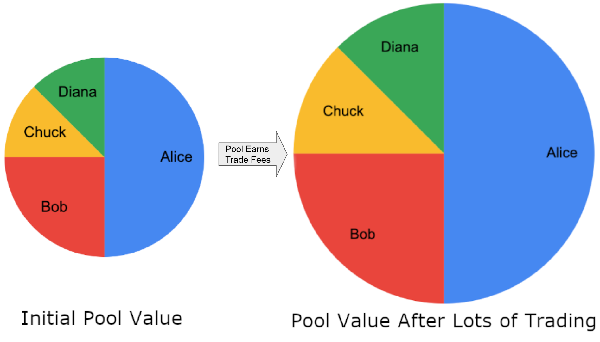

# Fees

## Trade Fees

### How are trading fees collected?

Trading fees are collected as the **input** token of a trade. Let's say there's a pool that trades between DAI and WETH and has a 1% fee. If Alice trades 100 DAI, the pool will keep 1 DAI and give her back 99 DAI's worth of WETH.

### How do I collect _my_ trading fees?

As pool collects fees, your Balancer Pool Tokens automatically collect fees since they represent your **proportional share** of the pool**.** 

Let's say Alice, Bob, Chuck, and Diana all provide liquidity in the same pool starting out worth $100. After some time, it has earned many trade fees and is now worth $200. The pool itself grows while their proportional shares stay the same. 

| Person | Proportional Share  | Initial Value | Value After Trading |
| ------ | ------------------- | ------------- | ------------------- |
| Alice  | 50.0%               | $50           | $100                |
| Bob    | 25.0%               | $25           | $50                 |
| Chuck  | 12.5%               | $12.50        | $25                 |
| Diana  | 12.5%               | $12.50        | $25                 |

### Dynamic Swap Fees

Balancer Pools can have either static or dynamic swap fees. For dynamic swap fees, pool owners can set these themselves, but it's also possible to have swap fees optimized by [Gauntlet](https://gauntlet.network). This [partnership](https://medium.com/gauntlet-networks/balancer-v2-pools-trading-fee-methodology-7a65df671b8c) seeks to help optimize returns for liquidity providers while removing a degree of freedom from the pool design process.

## Flash Loan Fees

When someone executes a successful flash loan, they must repay the loan with an interest rate defined by governance. The flash loan fee is collected by the protocol and it ultimately goes to the Balancer Treasury. See more in [Governable Protocol Fees](../governance/governable-protocol-fees.md).
