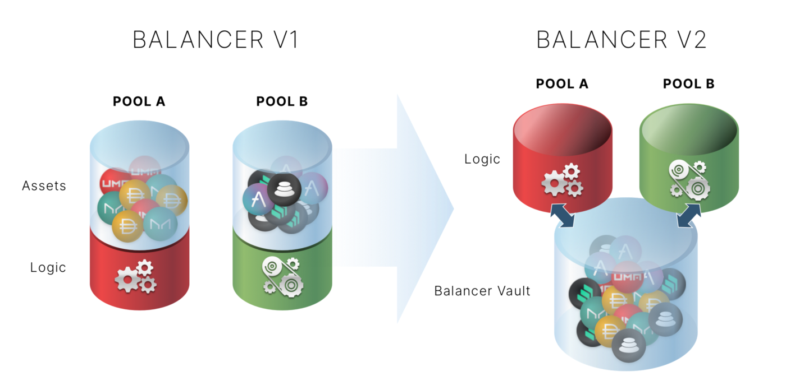
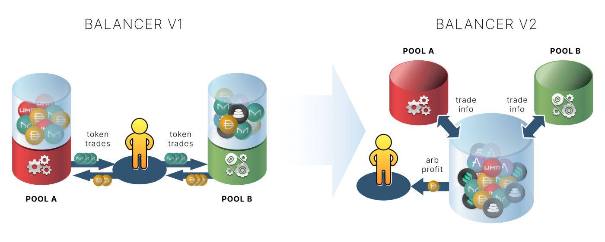

# Vault

## Overview

The Vault is the primary architectural change that distinguishes Balancer V2 both from its predecessor, and other current Decentralized Exchanges \(DEXs\). Instead of each pool holding its tokens, Balancer V2 is built on a single Vault that holds and manages the assets of all Balancer pools.

The Vault introduces many advantages over the traditional DEX architecture; it enables abstraction of pool logic, significantly cheaper multi-hop trades, high frequency trading, and more.

The Vault represents pools and complex balances \(cash + externally managed-assets\) as data structures inside a single contract. Pools are separate contracts, containing the price calculation and pool participation logic, registered with the vault and assigned Pool IDs. Asset manager contracts can remove tokens for investment or other purposes. Flash Loan provider contracts can "borrow" funds up to the entire TVL - as long as the funds are returned by the end of the transaction.

## Pool Abstraction

With the introduction of the Vault, Balancer Pools are now contracts that only need to handle the **logic** of swaps and liquidity provision/removal; all token transfers are handled by the Vault. This pool abstraction enables pool creators to design a pool with any arbitrary Automated Market Maker \(AMM\) equation they might want. 

It's crucial to note that the Vault is designed to keep pool balances strictly independent. This is critical for a permissionless system in which anyone can create their own tokens and pools. Maintaining this independence protects from malicious or negligently designed tokens or custom pools from draining funds from any other pools. As such, even though the Vault may hold consolidated liquidity of a certain token from multiple pools, the depth of that combined liquidity does not change price impact in the individual pools.

For more on pools, check out the Pools page:



## Gas Efficiency

With all tokens in Balancer Pools held in the Vault, there is no longer a need to transfer intermediate tokens during a multi-hop or split-route trade. All of the bookkeeping is done internal to the Vault, which properly allocates balances to each respective pool without needing to move tokens. Ultimately, the only tokens moved in a trade are the original inputs, and the desired outputs. Since much of the gas costs in executing decentralized trades is in the token transfers themselves, this shaves off precious gas fees from your transactions.

In addition to the Vault keeping track of pool balances, it can also keep track of "internal wallet balances." With internal balances, you can hold your tokens within the Vault and execute trades that get credited to your address' internal balance rather than actually moving tokens. When trading with internal balances, you'll only need to perform ERC20 transfers when you add or remove your tokens form the Vault. High frequency traders will greatly benefit from avoiding ERC20 transfers on every trade, and we expect aggregators to greatly benefit from reduced gas costs. 

## Flash Loans

While the consolidated liquidity in the Vault does not improve price impact on a per-pool basis, it does enable Balancer Protocol to leverage that combined liquidity by offering Flash Loans. Flash Loans are uncollateralized loans that must be repaid \(plus interest\) in the same transaction as it is borrowed. Since everything done with the loan must be completed in a single transaction, there are codified guarantees that make it impossible for borrowers to run away with the tokens.

Further, anyone who identifies a price discrepancy in two Balancer Pools can execute a **Flash Swap**. ****An arbitrageur who makes a flash swap does not need to hold any of the input tokens that one would normally need to make a trade. Instead, the trader identifies the imbalance, tells the Vault to make the swap, and is rewarded with the profit.

