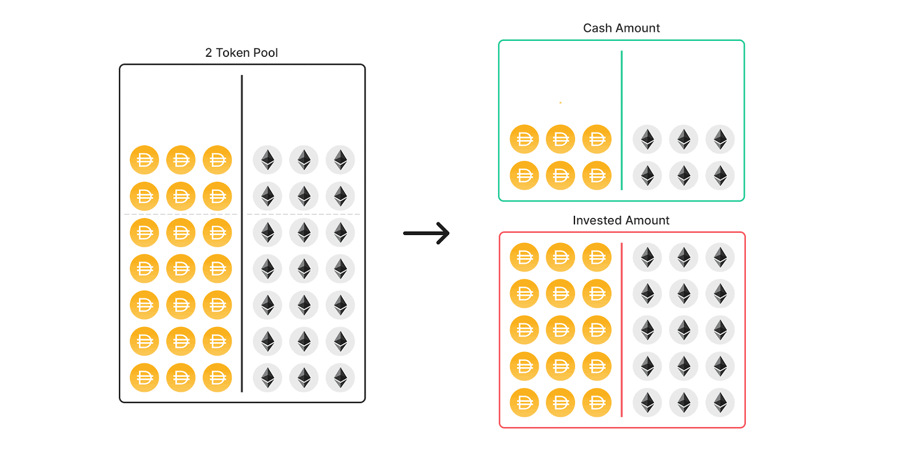

# Asset Managers


Coming soon! The first Asset Managers will arrive in the months following the Balancer V2 mainnet launch.  
  
There are also new pool types in development that achieve the capital efficiency goals of Asset Managers in a manner that concentrates liquidity better, while requiring less maintenance. The first solutions will likely be released in that form.  
  
The original asset manager architecture can be used any time tokens need to be removed from a pool \(e.g., for voting, or staking\), or when the pool needs to work with tokens incompatible with the Vault.


## Overview

Capital efficiency is very important to liquidity providers, and by leveraging Asset Managers,  portfolios can become much more productive. Normally in trading pools, only a small percentage of assets are actually used to facilitate trades. While deep liquidity results in smaller price impacts on trades, it also needlessly locks vast amounts of capital in pools. That's where Asset Managers come in; instead of holding idle assets, pools can send these tokens to Asset Managers for them to be invested elsewhere while internally maintaining the balances and facilitating trades as if the assets were there. 

## Example Applications

* Lend assets on Aave to earn interest
* Invest into Yearn Vaults
* Provide liquidity on a Layer 2 DEX

## How do Asset Managers affect prices in the pool?

When tokens are under control of the Asset Manager, the pool still needs to keep track of how many of each token are owned by the pool. Asset Managers need to periodically communicate to the pool how much it has under management, since the balances will change, and balances directly affect token prices.

## But what if...

#### ...the pool runs out of tokens?

If the balances of pool tokens have shifted due to a price change, the pool will need to replenish its stores. The pool can call tokens back from the Asset Manager to make sure it doesn't run out. By using a safety buffer, the pool can ensure that it has enough tokens before it gets too close to running out.

#### ...the Asset Manager makes a bad investment?

This is possible. Asset Managers are permissionless, and anyone can create one. It's possible that some have sub-optimal investment strategies, and it's also possible some bad actor could create a malicious Asset Manager. In order to prevent loss of funds, it's important to research any Asset Manager you might consider using and to understand the risks involved. To mitigate this risk, the default pool factories create pools which do not make use of Asset Managers such that this feature is opt-in.

