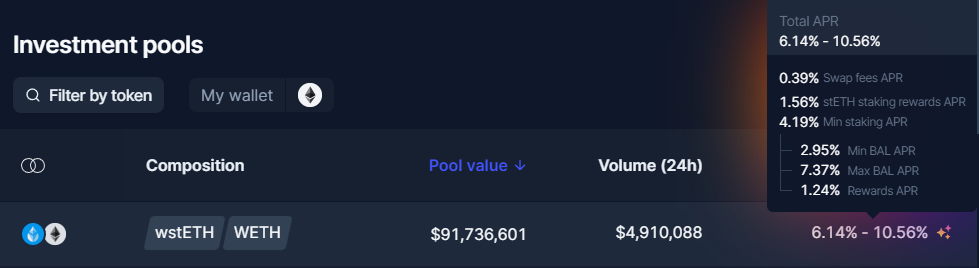

# Pools

## Overview

With the introduction of the Vault, Balancer Pools are now contracts that only need to handle the **logic** of swaps and liquidity provision/removal; all token transfers are handled by the Vault. This pool abstraction enables pool creators to design a pool with any arbitrary Automated Market Maker \(AMM\) equation they might want. 

## Standard Pools

Balancer V2 will launch with Weighted Pools, which are similar to the pools on Balancer V1:

### Weighted Pools

Weighted Pools are a generalization of the standard constant product AMM popularized by Uniswap. Each pool can contain up to 8 different tokens and each token is assigned a weight defining what fraction of the pool is made up by each asset. Balancer's weighted pool equation is a generalization of the x\*y=k by accounting for uneven weights and more assets:

$$
V = \prod_t B_t^{W_t}
$$

where V is constant, B is an asset's balance, and W is an asset's weight in the pool.

As the price of each token changes, arbitrageurs rebalance the pool by making trades. This maintains the desired weighting of the value held by each token whilst collecting trading fees from the traders.

### Stable Pools


Coming soon! The official Stable Pool factories will arrive in the weeks following the Balancer V2 mainnet launch.


For certain assets that are expected to consistently trade at near parity \(e.g. different varieties of stablecoins or synthetics\) a more efficient design is the StableSwap AMM as popularized by Curve. These pools allow for larger trades of these assets before encountering significant price impact.

## Custom Pools

Due to Balancer's abstracted pool architecture, it's very easy to implement new price curves for new AMM designs and integrate them into the protocol. New pool types can be developed and utilized by anyone, and the Balancer Community can vote to add support for these custom pools to the UI and/or SOR.

## Smart Pools


Coming soon! The first official Smart Pool factories will arrive in the months following the Balancer V2 mainnet launch.


The flexibility introduced doesn't just extend to control over the pricing curve used by the pool but can affect any aspect of the pool.

Balancer V1 introduced smart pools, which give external contracts control over parameters, and in V2 these features are integrated directly into the pools themselves. Thanks to Balancer's modular architecture, any of the smart contracts defining the behavior of a pool can be replaced as long as it maintains the common interface with the Vault.

The first smart pool to launch will be the Liquidity Bootstrapping Pool \(LBP\). It is a specialized 2-token WeightedPool, which restricts liquidity provision to the pool creator, and supports pausing trading, setting the swap fee, and changing weights gradually.

There are significant differences in the V2 LBPs:

* Weights change automatically; no triggering \(`pokeWeights()`\) necessary
* Pools can launch in a paused state
* Rights are revocable - pool owners can revoke any of the three available rights, making the pool more trustless \(e.g. revoke pausing and weight change to transition from an LBP to a smart treasury\)
* Pool owners can cleanly renounce ownership entirely, which allows public LPs, and effectively creates a WeightedPool \(though slightly less gas-efficient than a "native" WeightedPool\).

Likewise, there are two versions of the general Smart Pool \(for Weighted and Stable Pools\). These have very similar rights to V1 smart pools - except they are individually revocable. In addition, Weighted Pools may support a "circuit breaker", to halt trading for a token if the pool becomes "unbalanced" \(e.g., if a malicious or buggy token contract allows infinite minting, or otherwise breaks the pricing algorithm of the pool\).

