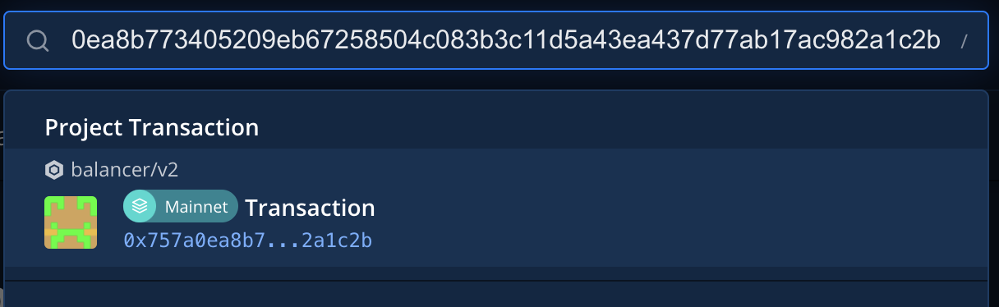
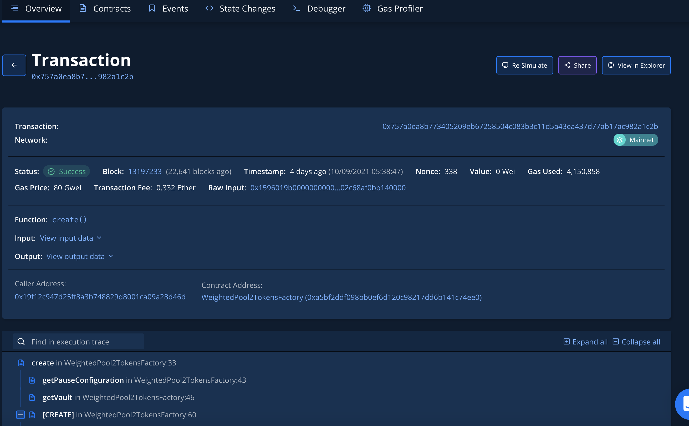
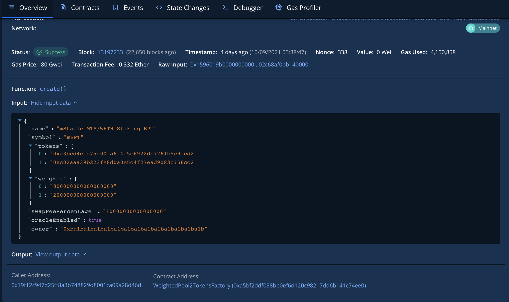
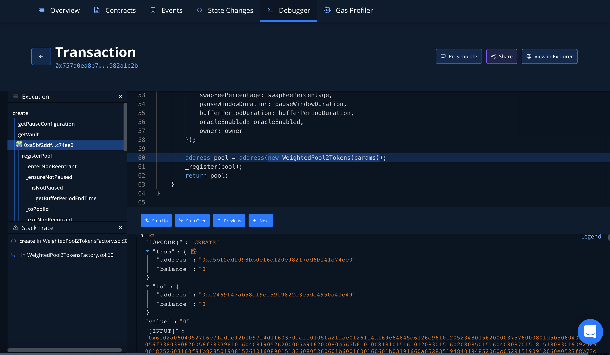

# Pool Verification

Apologies in advance... this ain't pretty.

Advances in the Solidity language have made it much more expressive, especially in terms of natively supported data structures. However, these features wreak havoc on tooling designed for simpler times: notably Etherscan contract interfaces and code verification.

Vendors have responded by improving support for this, vs earlier methods that relied on things like flattened files. Greater size and complexity have made these increasingly harder to produce: the solidity compiler handles circular references - but not most flattening tools.

Hardhat to the rescue - sort of. The hardhat verification plugin works well: but again, the devil's in the details. It is very hard to get the arguments exactly right for complex contracts. Here are instructions for how to verify your new V2 Balancer pool on Etherscan.

### Prerequisites

Theoretically you can compute the arguments from JSON using various tools, but the most reliable method is to read the arguments right off the blockchain. They're immutable, and guaranteed to be correct. To perform this most kludgy portion of the verification process, you will need a [Tenderly](https://tenderly.co) account. You can use the free version, and the easiest way to log in is through [GitHub](https://github.com). Developers likely already have a GitHub account - if you don't, that's also free.

You also need to issue the verification command to Etherscan, over a public network, wherever the contract is deployed: e.g., mainnet, Kovan, Polygon, Arbitrum. If you're not running your own node, this is most commonly achieved through [Infura](https://infura.io/docs/gettingStarted/authentication) or [Alchemy](https://docs.alchemy.com/alchemy/introduction/getting-started). You will need to provide an API key from one of these services in your hardhat network configuration. And since you are submitting a request to Etherscan, you also need an [Etherscan API key](https://etherscan.io/apidocs).&#x20;

Note that this also works for PolygonScan, but you will need a separate account and [API key ](https://polygonscan.com/myapikey)for Polygon. Arbitrum doesn't need a key (but the --key argument is still required; just use one of the others). If you are using Infura, you will need to enter billing information and, in the billing settings, add the networks to your account as "add-ons". Otherwise, you will see an error message like: "ProviderError: project ID does not have access to arbitrum l2"

Verification requires correct build artifacts (e.g., ABI code), and other infrastructure we've built into the repository, so you'll need to clone the [monorepo](https://github.com/balancer-labs/balancer-v2-monorepo), and issue the command from there.

### Process

Once you've cloned the monorepo, cd to pkg/deployments (**not** /deployments). You will need to add your network configuration to pkg/deployments/hardhat.config.ts.

Here is one way you might do it for mainnet, using Infura, and an account mnemonic. You could also use Alchemy, a private key, etc. See the [hardhat docs](https://hardhat.org/getting-started/) here. In this example, you would set the environment variables INFURA\_KEY and MNEMONIC.&#x20;


Needless to say, never put a real key in a file - even for a free account - especially if it might get committed to source control!


```
mocha: {
  timeout: 40000,
},
networks: {
  mainnet: {
    url: https://mainnet.infura.io/v3/${process.env.INFURA_KEY},
      accounts: [`0x${process.env.PRIVATE_KEY}`],
    },
  },
},
```

Here is the command you will execute in the /pkg/deployments directory:

```
npx hardhat verify-contract
  --id <task-id>
  --name <contract-name>
  --address <address>
  --network <network>
  --key <etherscan-api-key>
  --args <abi-encoded-constructor-arguments>  
```

As a concrete example, let's say we're verifying this Mainnet Oracle pool (click to follow the link):



If we're verifying an oracle pool, the contract name is WeightedPool2Tokens. This particular pool was deployed at 0xe2469f47ab58cf9cf59f9822e3c5de4950a41c49 (the first part of the poolId) on mainnet. That (plus the Etherscan API key) takes care of all the "middle" arguments. What about --id and --args? Those need a bit more explanation.

The hardhat deployment plugin is organized around "tasks." Each tasks corresponds to the deployment of one or more contracts. The "id" here is the name of the task where the relevant contract was deployed. Here's the list for the currently deployed Balancer pools. (Note that names are case-sensitive.)

| Task ID (--id argument)               | Contract name(s) (--name argument) |
| ------------------------------------- | ---------------------------------- |
| 20210418-weighted-pool                | WeightedPool, WeightedPool2Tokens  |
| 20210624-stable-pool                  | StablePool                         |
| 20210721-liquidity-bootstrapping-pool | LiquidityBootstrappingPool         |
| 20210727-meta-stable-pool             | MetaStablePool                     |
| 20210907-investment-pool              | InvestmentPool                     |

So far then, our command is:

```
npx hardhat verify-contract
  --id 20210418-weighted-pool
  --name WeightedPool2Tokens
  --address 0xe2469f47ab58cf9cf59f9822e3c5de4950a41c49
  --network mainnet
  --key <your-etherscan-api-key-here>
  --args <abi-encoded-constructor-arguments>  
```

Your Etherscan API key goes after --key. The tricky part is the last argument, and that's what makes verification so difficult: the constructor arguments.

We're going to pull them right off the blockchain, so the first thing we need to do is find the transaction where the contract was deployed.

To do this, we want to navigate to the "Internal Transactions" tab on Etherscan's entry for this address. The first (and likely only) transaction here will be the one that deployed the pool: [https://etherscan.io/address/0xe2469f47ab58cf9cf59f9822e3c5de4950a41c49#internaltx](https://etherscan.io/address/0xe2469f47ab58cf9cf59f9822e3c5de4950a41c49#internaltx)


Click on the "Parent Txn Hash" link to find the transaction hash: it is 0x757a0ea8b773405209eb67258504c083b3c11d5a43ea437d77ab17ac982a1c2b.

On Arbitrum, you will find there is no such tab. Never fear: you can also get the creation transaction from the subgraph. The subgraph url is: [https://thegraph.com/legacy-explorer/subgraph/balancer-labs/balancer-v2](https://thegraph.com/legacy-explorer/subgraph/balancer-labs/balancer-v2) for mainnet. For the other networks, it is "balancer-\<network>-v2". For instance, "balancer-polygon-v2".

You can use the following subgraph query to extract the creation transaction ("tx"):\
\
`{`\
&#x20; `pools(where:{address:"<pool address>"}) {`\
&#x20;   `id`\
&#x20;   `tx`\
&#x20; `}`\
`}`

We will now use the Tenderly Debugger to find the encoded constructor arguments. Log into Tenderly and copy the hash into the search bar. (On Arbitrum, until Tenderly supports it, you will have to get them from the Arbiscan data, or another way, such as a script, or simulating a mainnet transaction.)



You will see the details of the `create()` transaction



If you like, you can expand the input data tab for a human-readable representation:



However, what we need is the _encoded_ version. To get that, scroll down into the call tree and click on the \[CREATE] line:


Now click "View in Debugger":



The code we want  is in the "\[INPUT]" section. See that giant block of bytecode? We need to find the constructor arguments in all that. Luckily, there's an easy way to do it.

We know the first argument to a Balancer factory create is the Vault, and that the constructor arguments are at the end of the input data. So if we find the last occurrence of "\<Vault address>," we know the constructor arguments are everything from that point on.

They are sometimes preceded by the code "0033," but not always. So, search for this string:

`0000000000000000000000000000000000000000000000000000000000000020000000000000000000000000ba12222222228d8ba445958a75a0704d566bf2c8`

The encoded constructor arguments are then everything from the Vault address on:

`0000000000000000000000000000000000000000000000000000000000000020000000000000000000000000ba12222222228d8ba445958a75a0704d566bf2c8000000000000000000000000000000000000000000000000000000000000018000000000000000000000000000000000000000000000000000000000000001c0000000000000000000000000a3bed4e1c75d00fa6f4e5e6922db7261b5e9acd2000000000000000000000000c02aaa39b223fe8d0a0e5c4f27ead9083c756cc20000000000000000000000000000000000000000000000000b1a2bc2ec50000000000000000000000000000000000000000000000000000002c68af0bb140000000000000000000000000000000000000000000000000000002386f26fc10000000000000000000000000000000000000000000000000000000000000000000000000000000000000000000000000000000000000000000000000000000000000000000000000000000000000000000000000000000000000000000000000001000000000000000000000000ba1ba1ba1ba1ba1ba1ba1ba1ba1ba1ba1ba1ba1b000000000000000000000000000000000000000000000000000000000000001c6d537461626c65204d54412f57455448205374616b696e67204250540000000000000000000000000000000000000000000000000000000000000000000000046d42505400000000000000000000000000000000000000000000000000000000`

So the final command is:

```
npx hardhat verify-contract
  --id 20210418-weighted-pool
  --name WeightedPool2Tokens
  --address 0xe2469f47ab58cf9cf59f9822e3c5de4950a41c49
  --network mainnet
  --key <your-etherscan-api-key-here>
  --args <0000...giant string above...0000>  
```

