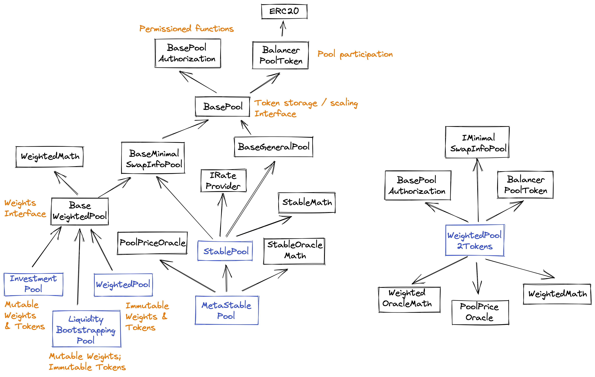

# Pools

Most pool operations are conducted through the Vault. See the [Vault API](vault.md) for the following functions.

```text
registerPool(PoolSpecialization specialization) returns (bytes32 poolID)

getPool(bytes32 poolId) returns (address pool, PoolSpecialization)

getPoolTokens(bytes32 poolId) returns (
    IERC20[] tokens,
    uint256[] balances,
    uint256 maxBlockNumber)
    
getPoolTokenInfo(bytes32 poolId, IERC20 token) returns (
    uint256 cash,
    uint256 managed,
    uint256 blockNumber,
    address assetManager)
 
joinPool(bytes32 poolId,
         address sender,
         address recipient,
         JoinPoolRequest request)
         
exitPool(bytes32 poolId,
         address sender,
         address payable recipient,
         ExitPoolRequest request)
```

Pools are token contracts, with the base class `BalancerPoolToken`. New pool types do not necessarily need to do tokenization this way \(or at all\). `BasePoolFactory` emits a `PoolCreated` event, while the Vault emits a `PoolRegistered` event.

The class hierarchy for pools is designed to allow for extension at multiple levels, and handle a lot of the housekeeping duties to keep the most derived pool classes short and readable.

The following diagram shows the current core pools, which all use the default tokenization base class. There are two core pools available at launch, with Liquidity Bootstrapping, Stable, and Metastable pools added later.

* **WeightedPool** - needed for pools with 2-8 tokens \(no oracle\)
* **WeightedPool2Tokens** - recommended for 2-token pools. These have oracle functionality \(see "Resilient price oracles" in [this article](https://medium.com/balancer-protocol/balancer-v2-a-one-stop-shop-6af1678003f7) for more information\), which can either be enabled on deployment, or disabled on deployment and enabled later through governance. Once enabled, an oracle can never be disabled - though it can be overridden by governance.
* **LiquidityBootstrappingPool** - a WeightedPool with 2-4 tokens, where trading can be halted, and weights can be changed over time. These pools do not allow public LPs.
* **StablePool** - 2-5 token pool using the Stableswap math library, intended for "pegged" tokens that have the same value \(no oracle\).
* **MetastablePool** - 2-token stable pool with an oracle, which supports "soft-pegged" tokens through `RateProviders`. Can also contain BPTs of other stable pools.

The other decision to make when creating a pool is the "owner." This affects the swap fee handling, and there are three choices:

* Zero address - swap fees are fixed after deployment
* "Delegate" address \(_0xBA1BA1ba1BA1bA1bA1Ba1BA1ba1BA1bA1ba1ba1B_\) - swap fees are dynamic, controlled by a third party designated by governance: currently [Gauntlet](https://medium.com/balancer-protocol/balancer-partners-with-gauntlet-to-make-dynamic-fee-pools-a-reality-97b3fb1760df).
* Any other address - swap fees can be changed from that account



The BasePool level defines constants, and defines the interface for the Vault, Pool ID, swap fee, token addresses, and scaling factors. The Vault does not perform any scaling \(e.g., adjusting for decimals in balances\), so this class contains utilities for converting native token balances to 18 decimals for the Vault \(i.e., 1 if it is already 18 decimals\). Generally, all incoming balances are "up scaled" before being sent to the Vault, and "down scaled" before being returned to the caller.

This level also contains the callbacks for joining and exiting - and enforces that these can only be called **from** the Vault.

Finally, `setSwapFeePercentage` allows for dynamic fees. If the Authorizer contract approves this function for a relayer \(e.g., Gauntlet\), that relayer is then allowed to set the swap fee for the pool. Otherwise, the swap fee is immutable unless, as described above, the pool has an owner. In that case, the owner can change the fees at will.

```text
getVault() returns (IVault vaultAddress)

getPoolId() returns (bytes32 poolID)

getSwapFeePercentage() returns (uint256 swapFeePercentage) 

// Can only be called by an authorized account
setSwapFeePercentage(uint256 swapFeePercentage)

// Can only be called by an authorized account (emergency stop)
function setPaused(bool paused)

onJoinPool(
        bytes32 poolId,
        address sender,
        address recipient,
        uint256[] currentBalances,
        uint256 latestBlockNumberUsed,
        uint256 protocolSwapFeePercentage,
        bytes userData
    ) returns (uint256[] amountsIn, uint256[] dueProtocolFeeAmounts)
    
onExitPool(
        bytes32 poolId,
        address sender,
        address recipient,
        uint256[] currentBalances,
        uint256 latestBlockNumberUsed,
        uint256 protocolSwapFeePercentage,
        bytes userData
    ) returns (uint256[] amountsOut, uint256[] dueProtocolFeeAmounts) {
```

The two core pools use different math, and also different price calculations. Stable Pools need all the token balances to quote a price during a swap, while Weighted Pools need only the balances of the two tokens being swapped. Weighted Pools can take advantage of this fact to save bytes and gas by using more efficient data structures. Any such pools can inherit from BaseMinimalSwapInfoPool.

As with WeightedPools, there will be both oracle and non-oracle versions of the StablePool. \(MetaStable pools have oracles.\) All oracle pools are 2-token pools; non-oracle StablePools can have up to 5 tokens \(in the current design\).

```text
// BaseMinimalSwapInfoPool
onSwap(SwapRequest request,
       uint256 balanceTokenIn,
       uint256 balanceTokenOut) returns (uint256 amount[In/Out])
```

Stable Pools inherit from BaseGeneralPool, and have a different swap interface. They take all the balances, along with pointers to the offsets of the two tokens being swapped.

```text
// BaseGeneralPool
onSwap(SwapRequest swapRequest,
       uint256[] balances,
       uint256 indexIn,
       uint256 indexOut) returns (uint256 amount[In/Out])
```

Each level contains internal callbacks \(e.g., `_initializePool`, `_doJoin`\), that need to be implemented by the most derived pools - in this case, the core pools.

Here's another view, showing some of the factories. The FactoryWidePauseWindow starts an "emergency period" from factory deployment. Within that period \(defaults to 3 months\), new pools deployed from that factory can be paused by governance. Afterward, all pools become trustless \(including any deployed after the end of the period\).


WeightedPool2Tokens \(oracle\) pools have the following additional interface:

```text
enableOracle() 

getMiscData() returns (
        int256 logInvariant,
        int256 logTotalSupply,
        uint256 oracleSampleCreationTimestamp,
        uint256 oracleIndex,
        bool oracleEnabled,
        uint256 swapFeePercentage)
        
getLargestSafeQueryWindow() external pure override returns (uint256)

enum Variable { PAIR_PRICE, BPT_PRICE, INVARIANT }

// Returns latest sample of `variable`.
// Prices are represented as 18 decimal fixed point values.
//
// Pair Price: the price of the second token in units of the
//             first token. For example, if token A is worth $2, 
//             and token B is worth $4, the pair price will be 2.0
// NB: decimals are accounted for; DAI/USDC ~ 1, though decimals differ
//
// BPT Price: the price of the Pool share token (BPT),
//            in units of the first token. Likewise decimal normalized
// Invariant: the value of the Pool's invariant,
//            which serves as a measure of its liquidity     
getLatest(Variable variable) returns (uint256)

struct OracleAverageQuery {
    Variable variable;
    uint256 secs;
    uint256 ago;
}

// Returns the time average weighted price corresponding to each of `queries`.
// Prices are represented as 18 decimal fixed point values.
//
// Each query computes the average over a window of duration `secs` seconds
// that ended `ago` seconds ago. For example, the average over the past 30 
// minutes is computed by settings secs to 1800 and ago to 0. If secs and ago
// are both 1800, that returns the average between 60 and 30 minutes ago    
getTimeWeightedAverage(OracleAverageQuery[] queries) returns (uint256[] results)

getPastAccumulators(OracleAccumulatorQuery[] queries returns (int256[] results)
```


Note that you can only call `getWeightedTimeAverage` after the buffer is full, or it will revert with ORACLE\_NOT\_INITIALIZED. If you call `getSample(1023)` and it returns 0's, that means the buffer's not full yet.


Liquidity Bootstrapping pools have the following additional interface:

```text
function getSwapEnabled() public view returns (bool)

/**
 * @dev Return start time, end time, and endWeights as an array.
 * Current weights should be retrieved via `getNormalizedWeights()`.
 */
function getGradualWeightUpdateParams() external view 
    returns (uint256 startTime, uint256 endTime, uint256[] memory endWeights)

// Permissioned functions

function setSwapEnabled(bool swapEnabled) external

/**
 * @dev Schedule a gradual weight change, from the current weights to the given
 * endWeights, over startTime to endTime
 */
function updateWeightsGradually(uint256 startTime, uint256 endTime,
                                uint256[] memory endWeights) external
```

Stable pools have the following additional interface:

```text
function getAmplificationParameter() external view
             returns (uint256 value, bool isUpdating, uint256 precision)

// Permissioned functions

/**
 * @dev Begins changing the amplification parameter to `rawEndValue` over time.
 * The value will change linearly until `endTime` is reached, when it will be
 * `rawEndValue`.
 *
 * NOTE: Internally, the amplification parameter is represented using higher
 * precision. The values returned by `getAmplificationParameter` have to be
 * corrected to account for this when comparing to `rawEndValue`.
 */
function startAmplificationParameterUpdate(uint256 rawEndValue,
                                           uint256 endTime) external
                                           
/**
 * @dev Stops the amplification parameter change process, keeping the
 * current value.
 */
function stopAmplificationParameterUpdate() external
```

Metastable pools expose the same Oracle and Stable functions, plus:

```text
function getRateProviders() external view returns (IRateProvider[] memory providers)

/**
 * @dev Returns the cached value for token's rate
 */
function getPriceRateCache(IERC20 token) external view
    returns (uint256 rate, uint256 duration, uint256 expires)

function updatePriceRateCache(IERC20 token) external

// Permissioned functions

function setPriceRateCacheDuration(IERC20 token, uint256 duration) external
```

Investment  pools \(version 1\) have the same weight changing interface as Liquidity Bootstrapping Pools, and the following additional functions:

```text
/**
 * @dev Returns the management swap fee percentage as a 18-decimals
 *      fixed point number.
 */
function getManagementSwapFeePercentage() public view returns (uint256)

/**
 * @dev Returns the mimimum duration of a gradual weight change
 */
function getMinimumWeightChangeDuration() external pure returns (uint256)

// Query the amount of management fees collected
function getCollectedManagementFees() public view
    returns (IERC20[] memory tokens, uint256[] memory collectedFees)
       
// Permissioned function for the owner to withdraw the collected fees
function withdrawCollectedManagementFees(address recipient) external
```

