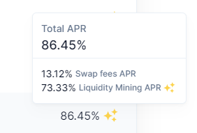

# Liquidity Mining

## How does Liquidity Mining on Balancer work?

Balancer offers a community driven Liquidity Mining program that is maintained by a Liquidity Mining committee, called “Ballers”. Ballers decide each week on how token distributions are allocated to the pools. Each weekend, they vote for the liquidity mining program for the following week. You can check out their progress on [Discord](https://discord.com/invite/ARJWaeF) in the \#liquidity-committee channel and follow their votes on their [Snapshot voting space](https://snapshot.org/#/ballersvote.eth).

You can see which pools receive liquidity mining incentives by the 3 star icon next to the pool position. Hover over the icon to see the breakdown in “Swap Fees APR” and “Liquidity Mining APR”

## What does “Swap Fees APR” and “Liquidity Mining APR” mean?

**APRs are estimates extrapolated from recent data and are not guaranteed**. Swap Fee APR is the expected annual percent rate the pool gets from swaps. Fees accrue to the pool so they automatically compound. Liquidity Mining APR is the expected annual return from liquidity mining. Liquidity mining distributions do not currently auto-compound.

Also please note that while the UI displays these as an APR, there is no compounding assumed in the Liquidity Mining APR. This is effectively an APR as the UI displays it, so you can expect a higher return if you choose to compound your token distributions.

## How are Liquidity Mining incentives distributed?

On Ethereum mainnet, weekly distributions are available through [https://claim.balancer.fi](https://claim.balancer.fi%20)

On Polygon, weekly distributions are airdropped directly to eligible wallets. **Only BAL is distributed by Balancer; all other airdrops are coordinated by their respective projects.** See the next question for the airdrop schedules.

## What is the Liquidity Mining timeline?

A liquidity mining period is set between Monday-Monday 00:00 UTC, with distributions becoming available **after the closing Monday**. If you begin to supply liquidity on Tuesday, you will NOT get distributions the next day \(Wednesday\) as that distribution is for people who provided liquidity the prior week.

Please see below for a diagram of the schedule. The below depicts Polygon airdrops, but the schedule for BAL on Ethereum is the same \(just use claim.balancer.fi to claim\).

## Does my investment auto-compound?

Many platforms provide so-called “vaults” where your liquidity mining distributions are compounded in a regular time interval; this is not the case for Balancer. Balancer currently distributes its LM incentives on a weekly basis. Therefore, if you want to compound, you can simply re-invest your liquidity mining distributions after each weekly distribution.

## **How are token distributions on Balancer calculated?**

Liquidity mining distributions are calculated using hourly snapshots of all pool token holders. Liquidity Providers receive a share of that time period's tokens, and the amount they receive scales with their proportional share of the pool. The token distributions are then summed up from Monday to Monday to get the grand total.

See the [code](https://github.com/balancer-labs/bal-mining-scripts) and [weekly reports](https://github.com/balancer-labs/bal-mining-scripts/tree/master/reports) on GitHub.

## How do I find my distributions on the liquidity mining report?

If you are eager to check out your distribution for the previous mining period, you can check out the [Balancer Liquidity Mining reports](https://github.com/balancer-labs/bal-mining-scripts/tree/master/reports).

In each weekly folder, you'll find a few files:

* **\_totalsLiquidityMining.json**
  * the totals for LM on Ethereum
* **\_gasReimbursement.json**
  * the amounts for Gas Reimbursements through the BAL for Gas program on Ethereum
* **\_totals.json**
  * the sum of the two files above

You'll also find network/token specific files for multi-token incentives explained below

| File Name | Network | Token Symbol |
| :--- | :--- | :--- |
| \_\_ethereum\_0xba100000625a3754423978a60c9317c58a424e3d.json | Ethereum | BAL |
| \_\_polygon\_0x9a71012b13ca4d3d0cdc72a177df3ef03b0e76a3.json | Polygon | BAL |
| \_\_polygon\_0x0d500b1d8e8ef31e21c99d1db9a6444d3adf1270.json | Polygon | MATIC \(or WMATIC\) |
| \_\_polygon\_0x580a84c73811e1839f75d86d75d88cca0c241ff4.json | Polygon | QI |
| \_\_polygon\_0xF501dd45a1198C2E1b5aEF5314A68B9006D842E0.json | Polygon | MTA |

### 

