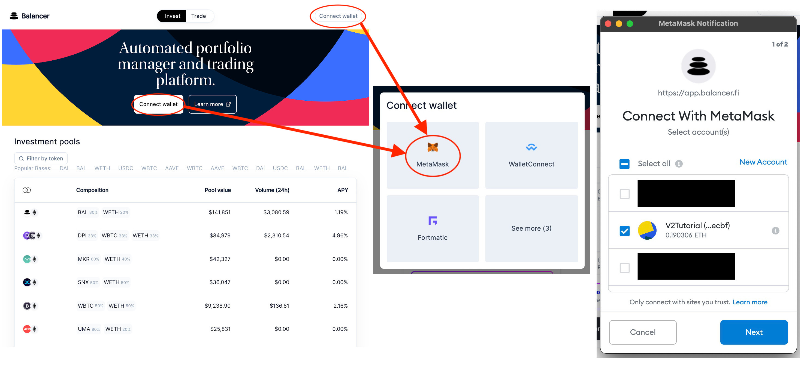

# Invest

## Adding liquidity

### Connect Wallet

Click one of the "Connect wallet" buttons, click MetaMask, and connect your desired wallet in the extension popup.

### Pick your pool

\*\*\*\*

**Filter pools by desired assets. In this example, we'll use WETH and BAL**

Click on the desired pool to navigate to the pool management page

### Select your amount

You can choose to invest one token, a subset of tokens, or all of them. The pool will calculate how many pool tokens \(BPTs\) to give you for your input tokens. If you join the pool according to pool weights \("Best price"\), you will not create any price impact. If you join in an unbalanced way \("Custom amounts"\) you may impact the price.


If your "Custom amounts" join has significant price impact, it may be cheaper to swap your tokens to match the "Best price" amounts. If you significantly impact the price in a pool, you can create an arbitrage opportunity that someone else may profit from.


To invest a single asset, choose "Custom amounts".

### Approve token\(s\)

### Click "Invest" to add tokens to the pool

### **Withdrawing Liquidity**

### Click on the pool in "My V2 Investments"

### Click on the "Withdraw" Tab

### Select the amount you wish to withdraw

You can choose to withdraw a subset of tokens or all of them. If you decide to withdraw only one toke you can withdraw up to the whole value of your investment. In that case, the app will automatically swap other tokens to the one you're withdrawing. Eg it will sell the WETH in that pool and buy the BAL you're requesting. To withdraw a single asset, choose "Custom amounts".

### Click to withdraw tokens from the pool

