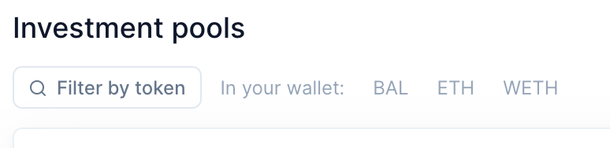
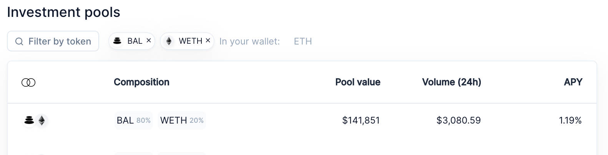
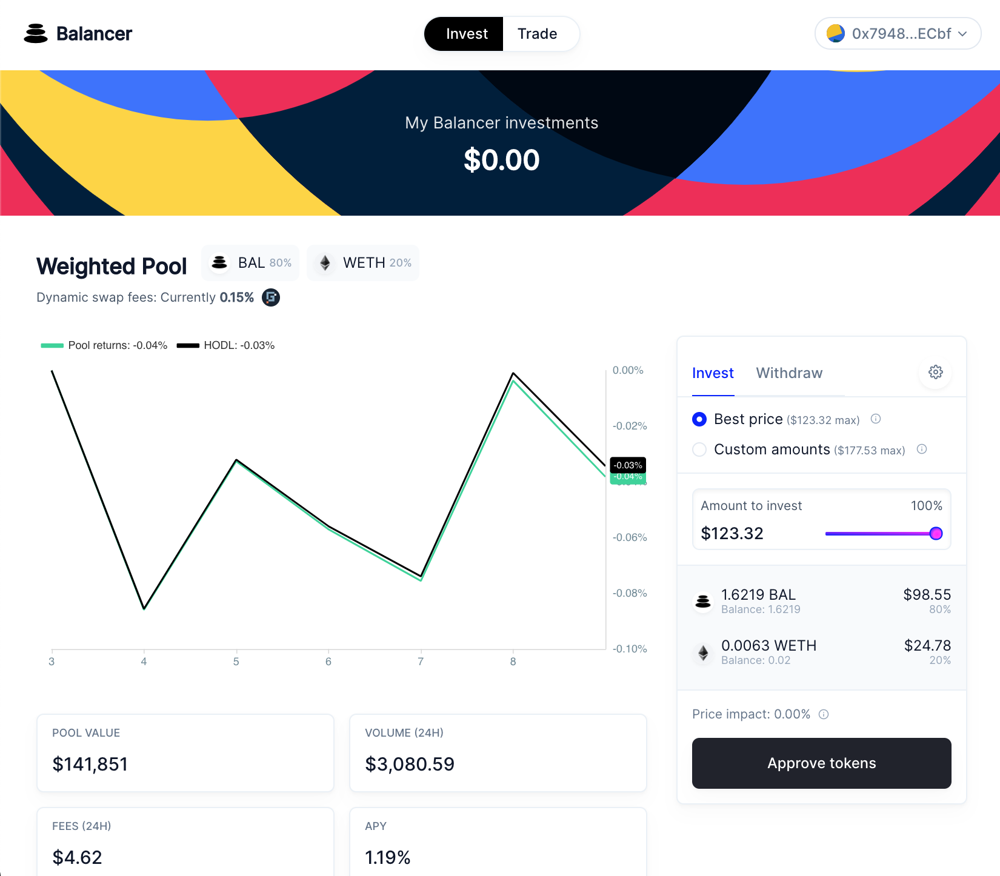
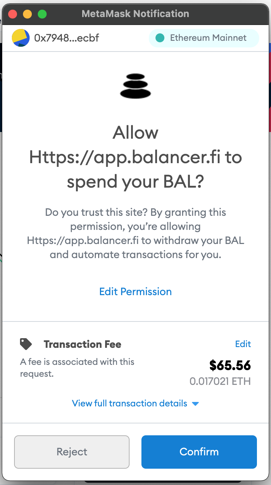
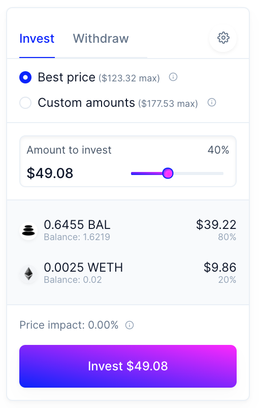
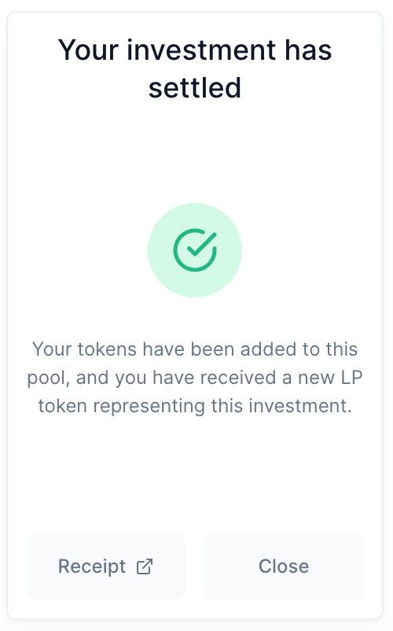
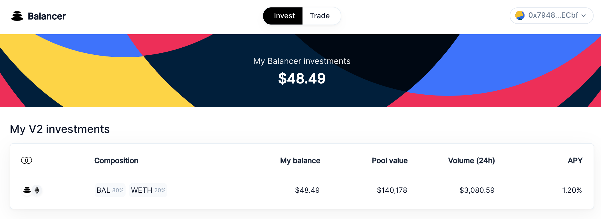
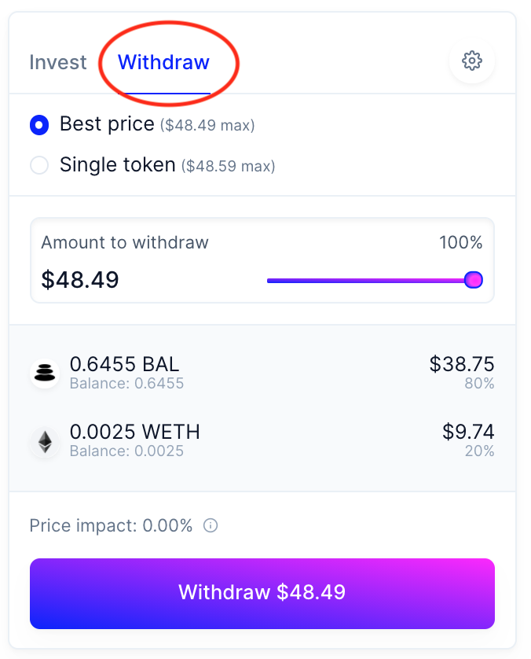
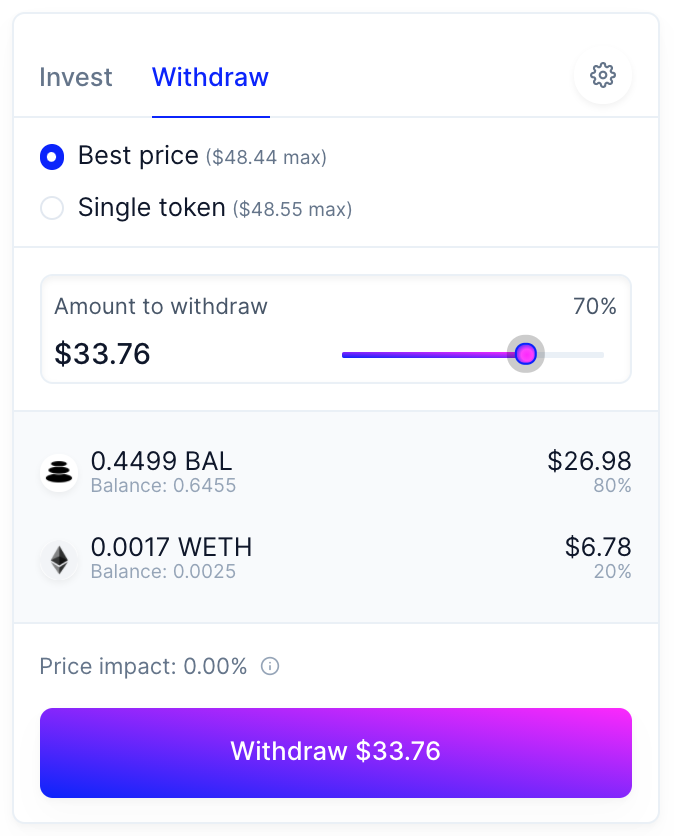

# Invest

## Adding liquidity

### Connect Wallet

Click one of the "Connect wallet" buttons

### Pick your pool

\*\*\*\*

**Filter pools by desired assets. In this example, we'll use WETH and BAL**

Click on the desired pool to navigate to the pool management page

### Select your amount

### Approve tokens

### Click "Invest" to add tokens to the pool

### **Withdrawing Liquidity**

### Click on the pool in "My V2 Investments"

### Click on the "Withdraw" Tab

### Select the amount you wish to withdraw

### Click to withdraw tokens from the pool

