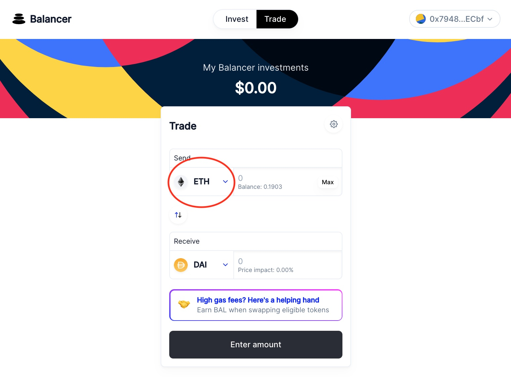
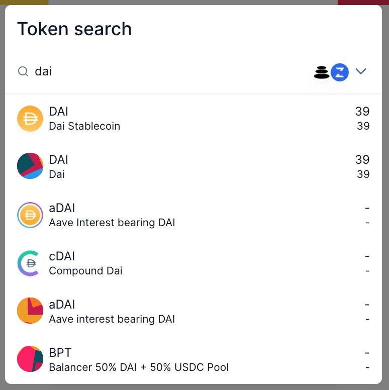
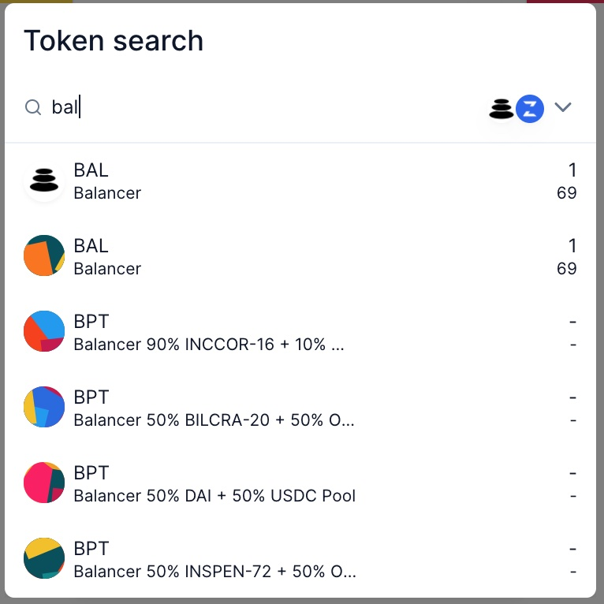
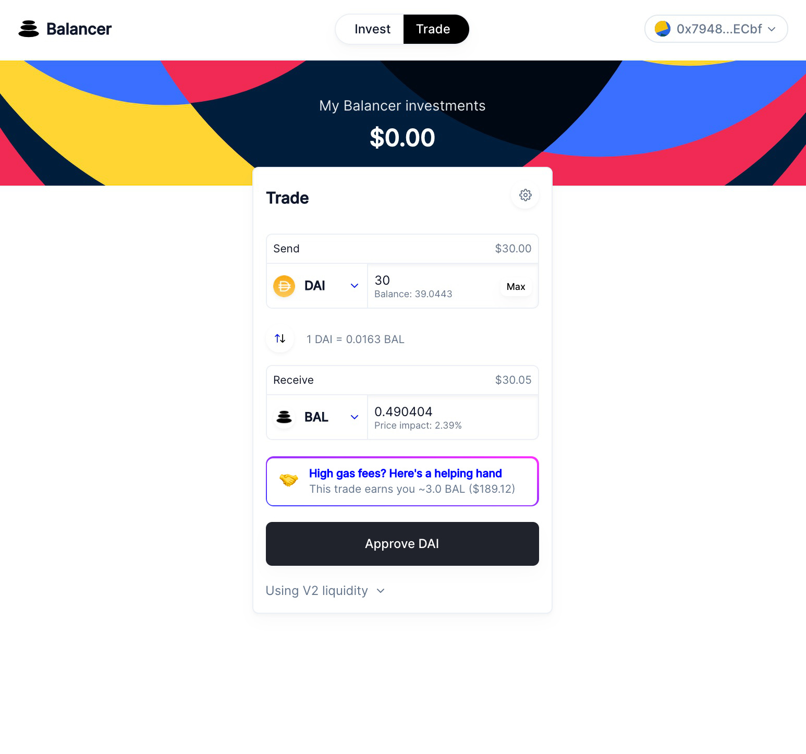
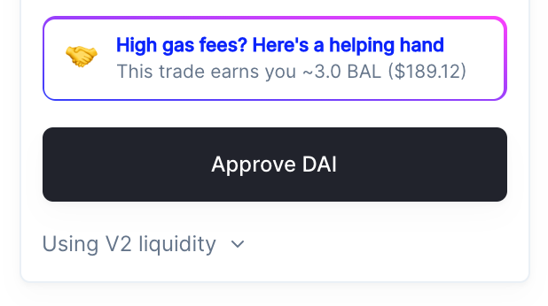
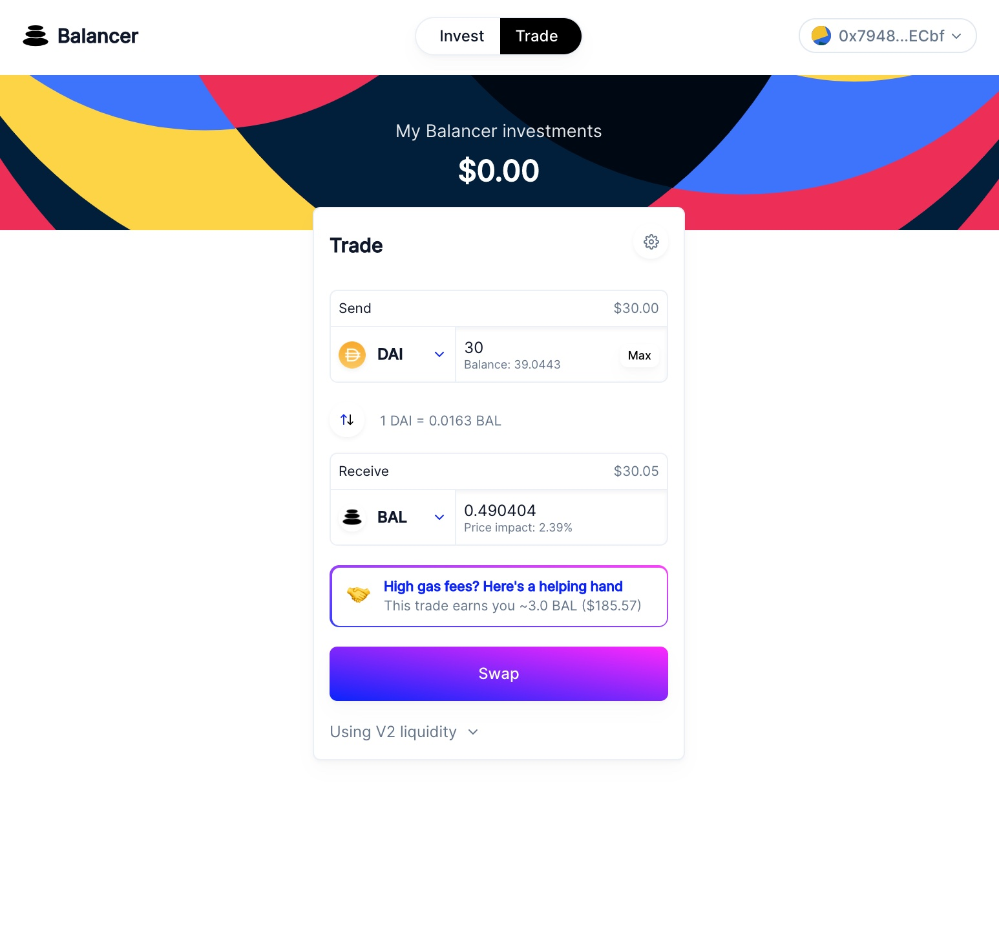
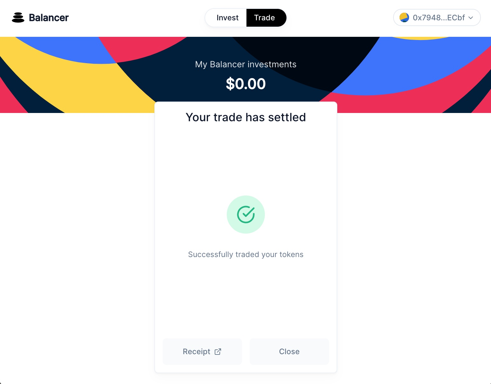

# Trade

## Overview

This walkthrough will go over the minimal steps to execute a standard trade. 

## Go to the Balancer App

Navigate to [https://app.balancer.fi/\#/trade](https://app.balancer.fi/#/trade)

## Connect your wallet

\(We're using MetaMask in this example\)

Click one of the "Connect wallet" buttons, click MetaMask, and connect your desired wallet in the extension popup.

## Select your trade tokens

### Pick your input token

### Pick your output token

## Enter trade amount

You can specify either an input amount or an output amount

## Approve the input token


**Why?** You need to "Approve" tokens on Balancer \(and any other decentralized exchange\) because you need to authorize the exchange to move your input token on your behalf



Since Balancer Protocol V2 is an entirely different system from V1, approvals unfortunately do not carry over; you will need to re-approve tokens.


Approving your token will issue an Ethereum transaction that will have a gas cost. This is **not** paying a fee for your trade; you will need to issue another transaction.

## Make your swap

Click swap and approve the transaction in MetaMask.

### Wait for your trade to get executed, and get your receipt!

