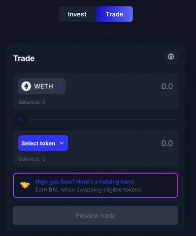
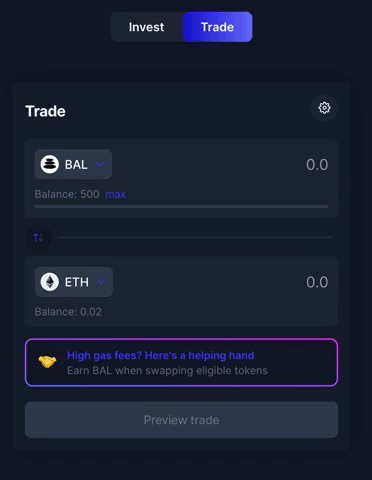

# Trade

Navigate to [https://app.balancer.fi/#/](https://app.balancer.fi/#/trade) and click on the "Trade" button. This action leads the user to the Balancer Trading page.

## Connect your wallet

.jpg>)

To make a swap, follow the steps outlined below:

* Select the desired tokens you intend to swap as the example below. If you cannot find your desired token on the default list, you can use the search function (this works with token names, symbols or token addresses)

* Select the number of Tokens you wish to exchange and click on "preview trade" as shown below:

* If this is the first time the input token is intended to be traded on Balancer, it is necessary to approve the token first before executing the trade. This action is necessary only once per token and is a normal procedure.&#x20;


**Why?** You need to "Approve" tokens on Balancer (and any other decentralized exchange) because you need to authorize the exchange to move your input token on your behalf

Approving your token will issue an Ethereum transaction that will have a gas cost. This is **not** paying a fee for your trade; you will need to issue another transaction.


* After approving the token (when necessary), the trade can be executed by confirming the trade on the Balancer App and interacting directly with your Web3 wallet.
