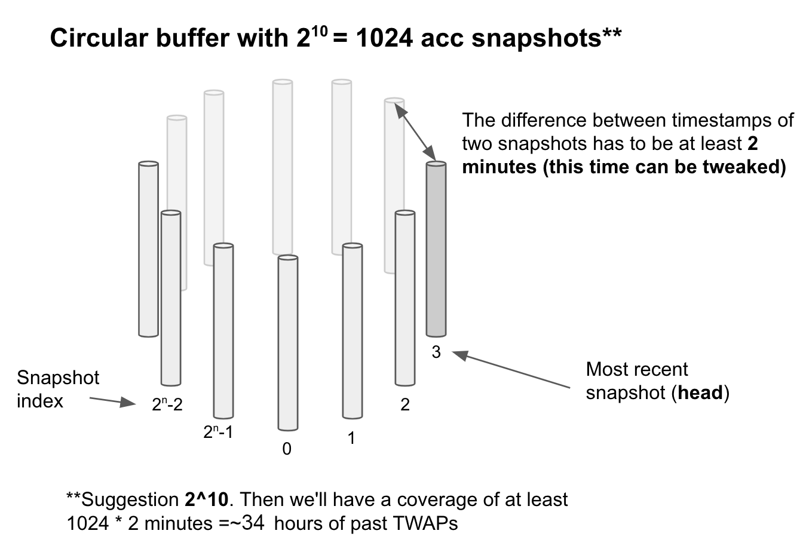

# Oracles (deprecated)


## Oracles have been deprecated.

### Why?

1. **Limitations**
   * Oracles only exist in two-token pools, while many of the primary pools (like bb-a-USD) on Balancer have 3 or more tokens. Supporting multi-token pools requires tracking all possible pairs, which scales combinatorially `O(nC2)`.
2. **Security/Manipulation**
   * Though there have been no known manipulations, TWAP oracles can be more manipulable than alternatives that uses a median filter, which are too complex to readily implement on chain.
   * Manipulation can only get worse after the Merge because two-block attacks will become commonplace. A cornerstone of what made these oracles "safe enough" pre-Merge is that an oracle could only be updated once per block. This means that anyone who would seek to manipulate it atomically only has one chance to force it out of alignment, and it's usually not enough. But in Proof of Stake, block validators are known several minutes ahead of time, and occasionally a validator is going to get two blocks in a row. This offers a much better chance at manipulation, and we don't know what will happen to TWAP oracles under these conditions because they have never been possible before.
3. **Maintenance Burden**
   * The oracle is a complex piece of functionality that bogs us down when developing other features. Known external use of our oracles is limited so the cost/benefit trade-off is not there.

### What does this mean?

Pool factories deployed after mid-2022 will not have oracle functionality. Pre-existing pool factories that _do_ have oracle function can not be disabled. Therefore, it is and always will be possible, though inadvisable, to deploy pools that have oracles. Any pre-existing pools that do have oracles cannot be disabled. Using these pools as oracles is highly discouraged. Discouraging the use of oracles in these pools does not imply any additional safety concerns with other operations such as joining, exiting, or swapping.&#x20;

Anyone is able to design their own pool that interacts with Balancer. There is a possibility that a team will build a custom pool that acts as an oracle provider. They may be correct and/or implement novel safety/algorithmic improvements, but use these price feeds at your own risk.&#x20;

### This page below will be kept as a technical and historical reference. There is a strike-through for all text since there may be links to sub-sections of this page.



~~Looking for the Oracle API? Check out~~ [~~this page~~](https://dev.balancer.fi/references/contracts/apis/pools/weightedpool2tokens) ~~in our Developer Docs!~~


## ~~Overview~~

~~Some Balancer pools have oracle functionality, which allows them to be price sensors for their tokens as well as their own Balancer Pool Tokens (BPTs). These oracles can be used in two ways:~~

* ~~Instantaneous Price~~
* ~~Time Weighted Average Price (TWAP)~~

~~Some Balancer pools that have Oracle functionality are:~~

* ~~WeightedPool2Tokens~~
* ~~MetaStablePool~~

~~The relevant contracts for Oracle implementation can be found~~ [~~here~~](https://github.com/balancer-labs/balancer-v2-monorepo/tree/d2794ef7d8f6d321cde36b7c536e8d51971688bd/pkg/pool-utils/contracts/oracle)~~.~~

## ~~Instantaneous Price~~

~~Querying Instantaneous Price is a low gas operation useful for applications where price manipulation is not of great concern. These queries can be done using:~~

* ~~~~[~~`getLatest`~~](https://dev.balancer.fi/references/contracts/apis/pools/weightedpool2tokens#getlatest)~~~~
* ~~``~~[~~`getPastAccumulators`~~](https://dev.balancer.fi/references/contracts/apis/pools/weightedpool2tokens#getpastaccumulators)~~``~~

## ~~Time Weighted Average Price~~

~~Oracles can be queried for a Time Weighted Average within time frames ranging from a minimum of 2 minutes to a maximum of \~34.1 hours. These queries can be done using:~~

* ~~~~[~~`getTimeWeightedAverage`~~](https://dev.balancer.fi/references/contracts/apis/pools/weightedpool2tokens#gettimeweightedaverage)~~``~~

### ~~Calculating TWAP~~

~~Oracles keep an accumulator with the sum of all past values, each weighted by the time elapsed since the previous update. This lets us later subtract accumulators at different points in time and divide by the time elapsed between them, arriving at the geometric mean of the values (also known as log-average).~~

### ~~The Accumulator~~

~~Price data for each sample is kept within an accumulator.~~&#x20;

.png>)

~~The accumulator is structured with:~~

* ~~10 bits for the head index (explained in more detail below)~~
* ~~32 bits for the `timestamp` of when the acc was last updated~~
* ~~214 bits for `priceAcc` which is the actual accumulator of the pair price. The price accumulator is factored into two numbers:~~
  * ~~`price`: 182 bits =\~ 6.13 \* 10^54, so we have a huge range of possible prices even given the fact that prices will always be scaled to 10^18.~~
  * ~~`priceMultiplier`: instead of storing the `priceAcc` directly in a 214 bit-word we factor it into two components, the `price` and the `priceMultiplier` such that `priceAcc = price * priceMultiplier.` The reason for this is that while the accumulated price is only useful when two timestamps are taken into consideration for a TWAP, having the instant price information available can be extremely valuable for some use cases.~~

### ~~The Circular Buffer~~

~~Maintenance of oracles using Uniswap TWAP has been one of the main pain points for teams using it. They have to have incentive schemes in place to make sure that their contracts are storing snapshots of the Uniswap accumulator in a given frequency.~~

~~In order for our oracle to **not require maintenance,** we store 2^10 = 1024 snapshots of the main accumulator at least two minutes apart from each other. These snapshots are stored in a simple circular buffer, where the 1025th element will just overwrite the first snapshot with index 0. This means that we can provide a TWAP for any duration larger than 2 minutes and smaller than 1024 \* 2 min = 2048 min =\~ 34.1h.~~
