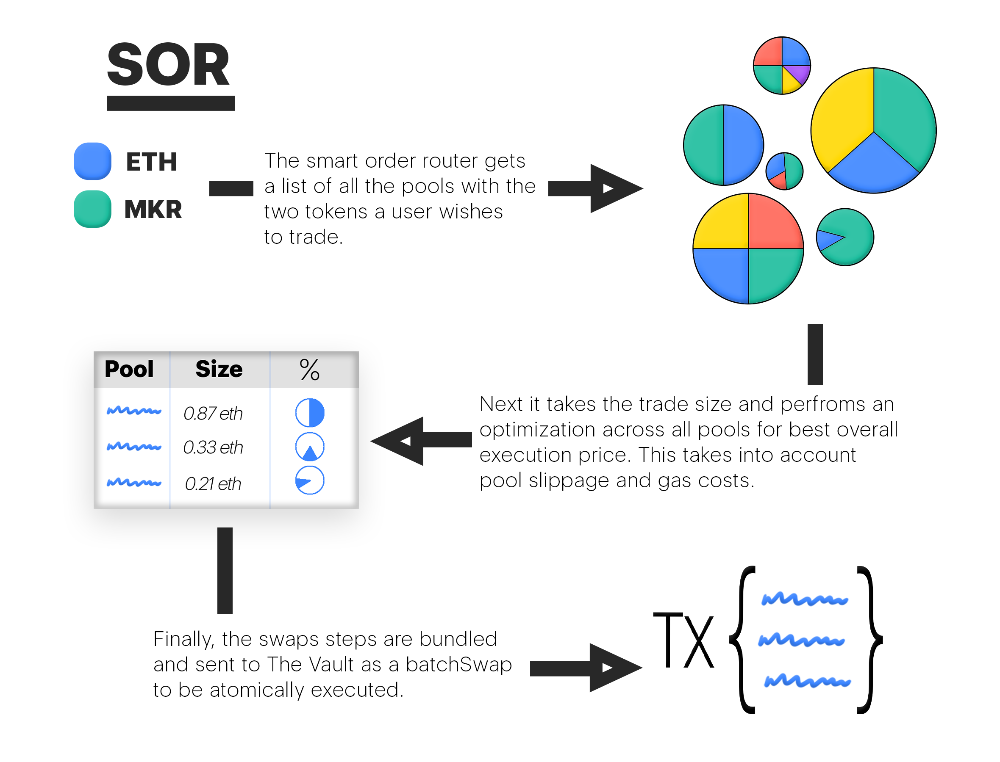

# Smart Order Router

## Overview

The Smart Order Router (SOR) finds the best prices for Balancer traders. For given input and output tokens, the SOR finds the optimal trades whether that is a direct swap in one pool, or a combination of trades hopping through multiple pools.

## Utilize All the Liquidity!

As the variety of [Balancer Pools](broken-reference) grows, the SOR grows too! The SOR keeps expanding as  new pool types that use different math under the hood are added. This ensures that all pools in the Balancer ecosystem can support trades. By integrating with the SOR, any custom pool built on Balancer can benefit from all the other Balancer liquidity. All you need to integrate a pool is first and second order differentiable `spotPriceAfterSwap` functions (differentiable either numerically or analytically).

## Taking Gas Into Account

In an ideal world in which gas costs are negligible, a trade between two tokens would involve each Balancer pool that contains that pair. This would utilize all the available liquidity for the trader and maintain equal prices across all pools. Such a scenario would be an _arbitrage-free state_, in which no value could be extracted from the pools' price differences.

Since there _are_ incremental gas costs for each swap added to a batch, additional pools are added to the path only when they provide enough of a price difference to make up for the gas. Since only a subset of pools are considered, this can create arbitrage opportunities across Balancer pools.

## How It Works

The optimization mechanism finds the path through a set of Balancer Pools with the greatest output (after gas costs).

### Multiple Pools, Same Spot Price

In order to get the best price for a trader, the SOR is designed to create an arbitrage-free state between the paths it's using. In order to achieve this, **each path the SOR routes through needs to provide the same spot price after the swap has completed.**&#x20;

.png>)
